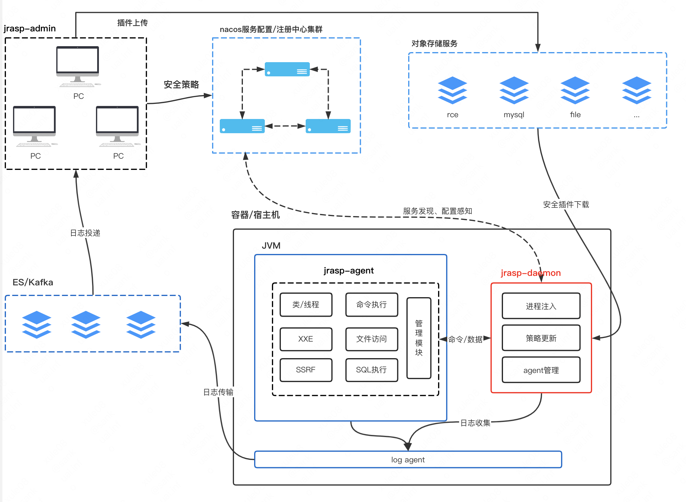

# jrasp-daemon

## 关于 jrasp-daemon

`jrasp-daemon` 是一个用户态的程序，主要是用来与Java Agent通信，对安全模块的生命周期进行控制，包括自身更新、安全module更新等。

jrasp-daemon 基于`Golang`构建。


## 平台兼容性

理论上，所有Linux下的发行版都是兼容的，但是只有Debian(包括Ubuntu)与RHEL(包括CentOS)经过了充分测试，对于Agent本身，支持amd64与arm64。

为了功能的完整性，你可能需要以`root`权限运行`jrasp-daemon`

## jrasp-agent 协同工作

jrasp采用分体式架构, 将非必要进入业务进程的逻辑单独抽取成出独立Daemon进程，最小化对业务的侵入及资源占用, 提高可用性及稳定性。


## 需要的编译环境

* Golang 1.17.5 (必需)

## 编译 Daemon

```
go build -o bin/jrasp-daemon
```

## 依赖 nacos 配置中心

nacos配置中心版本 `2.0.3`

## 安装并启动Daemon

在获取上述二进制产物后，在终端机器进行安装部署：
> 不同机器间需要分发产物，在这里不做阐述

安装到jrasp-agent 目录下
+ 分别将工程目录下`bin/jrasp-daemon`、`bin/jattach` 复制到 `jrasp-agent/bin`
+ 将`cfg/config.yml` 复制到 `jrasp-agent/cfg`下


配置守护进程动（必需）：
> 在这里没有提供进程守护与自保护，如有需要可以自行通过systemd/cron实现，这里不做要求

## 验证Daemon状态
查看Daemon日志，如果看到已经启动并不断有心跳数据打印到日志中，则部署成功；如果进程消失/无(空)日志/stderr有panic，则部署失败，如果确认自己部署步骤没问题，请提issue或者群里沟通。

```
ps aux|grep jrasp-daemon
cat ./logs/jrasp-daemon.log
```

## 项目使用的三方工程

### 动态attach功能使用开源项目`jattach`

### 整体框架使用字节跳动 `HIDS`

对于上面的开源项目，再此一并表示感谢